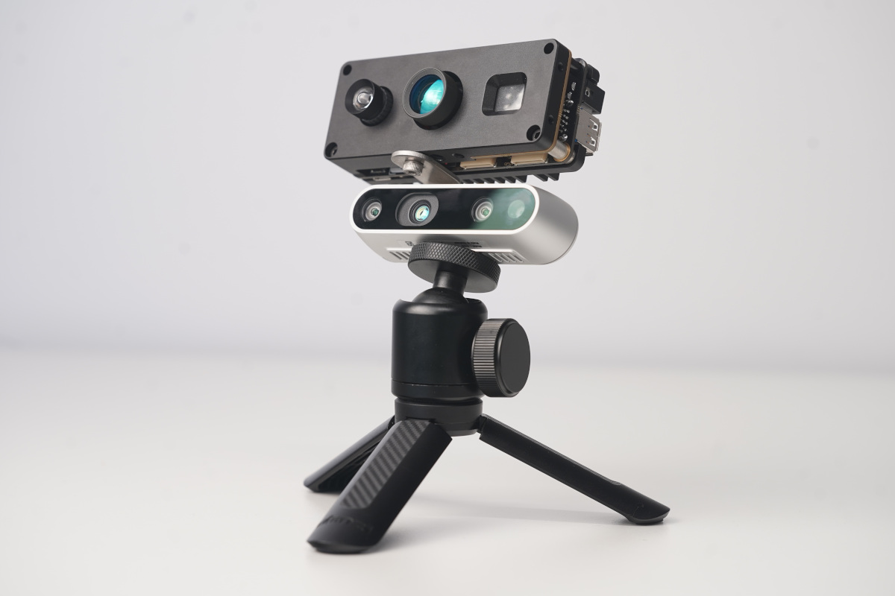
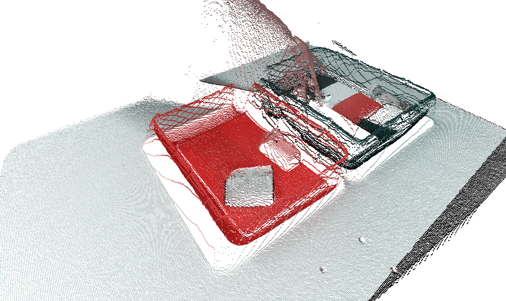
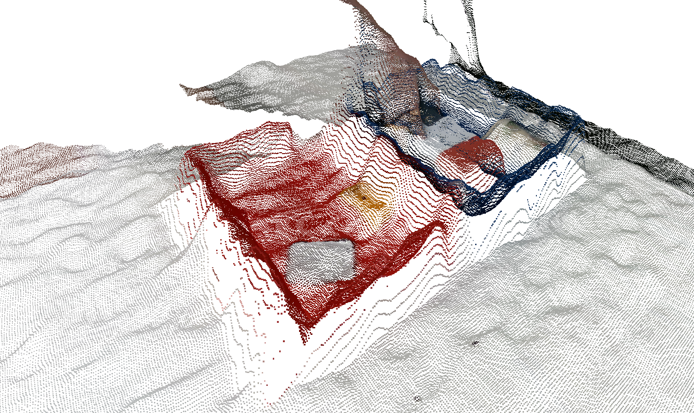

# Kea Versus Intel RealSense D435

## Description
Code and PointCloud results for comparing the [Chronoptics](https://www.chronoptics.com/) [KEA](https://www.chronoptics.com/cameras) Depth camera to the Intel RealSense [D435](https://www.intelrealsense.com/depth-camera-d435/)

We wanted to compare the output of the Kea camera with the D435, so we bolted them together like below and captured different test scenes. 

The Python code used to capture, process and export to PLY's is provided in the python folder, and the single frame PointClouds in the Python folder, and PLY Point Clouds in the results folder. The video of the outputs will be put on youtube. 

## Results 

Example of the output from Kea for bin picking. 

Example of the output 
